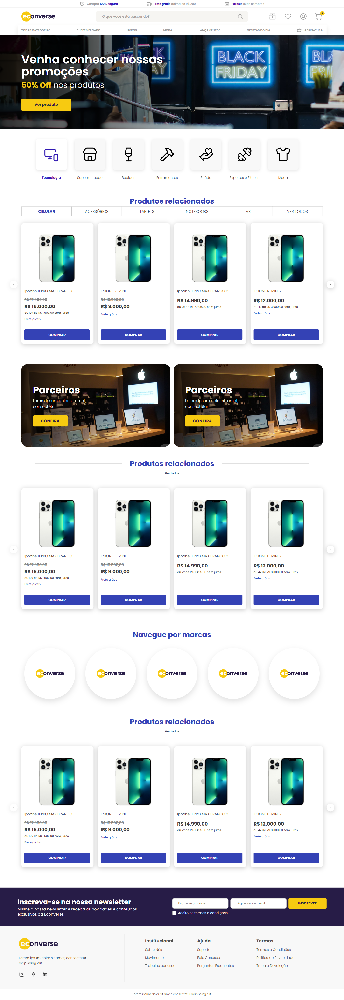
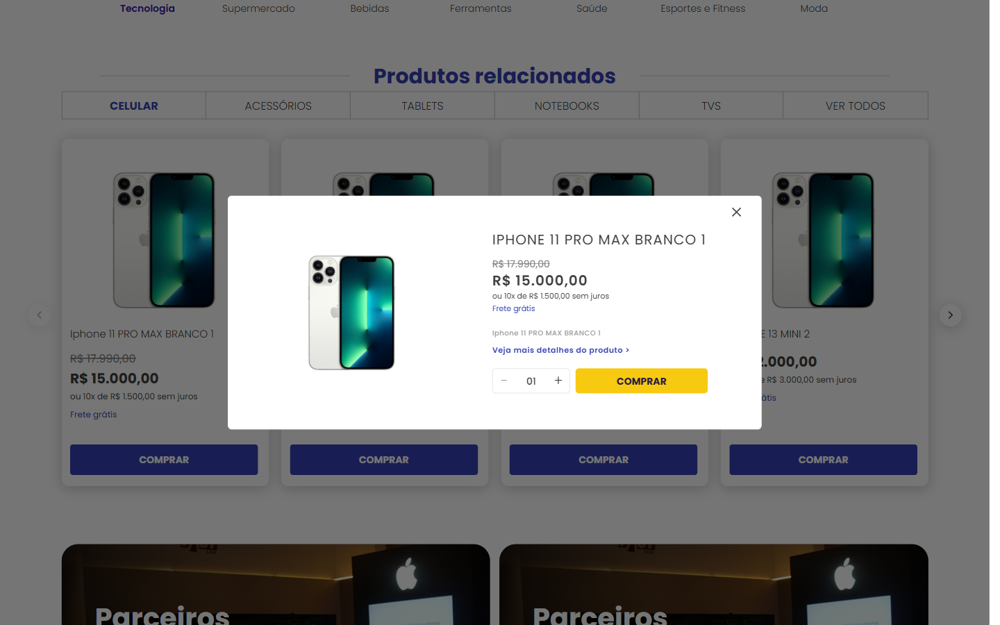
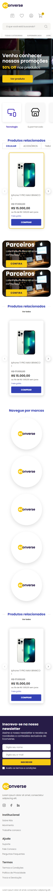

# Teste Econverse: Vaga Desenvolvedor Front-End

Página de e-commerce em **React + TypeScript** fiel ao layout do Figma, com vitrine de produtos alimentada pelo JSON remoto e modal de produto.

**Online:** https://teste-front-end-rafaelnovais.vercel.app/

## Capturas de tela

| Desktop (1440px) | Modal do produto | Mobile (375px) |
|---|---|---|
|  |  |  |

## Requisitos atendidos

- React 19 + TypeScript (`strict`), Vite.
- Sass com CSS Modules; **nenhuma biblioteca de UI/CSS**. Carrossel, modal, abas e demais componentes são escritos à mão.
- Vitrine consumindo o [JSON de produtos](https://app.econverse.com.br/teste-front-end/junior/tecnologia/lista-produtos/produtos.json).
- Modal com as informações do produto clicado (nome, descrição, foto, preço e extras), acessível por teclado.
- Responsivo (mobile, tablet e desktop).
- SEO e HTML semântico: `header`/`main`/`footer`/`nav`/`section`/`article`, `h1` único, `alt` nas imagens, `meta description`, Open Graph, `robots.txt`.

## Como rodar

Requer Node 20.19+ (ou 22.12+) e npm.

```bash
npm install
npm run dev
```

A aplicação abre em http://localhost:5173. Em desenvolvimento, as requisições a `/api` passam por um proxy do Vite, porque a API não envia cabeçalhos CORS (veja [ADR-0007](docs/adr/0007-dev-proxy-for-products-api-cors.md)).

## Scripts

| Comando | O que faz |
|---|---|
| `npm run dev` | Servidor de desenvolvimento com HMR |
| `npm test` | Testes (Vitest + React Testing Library) |
| `npm run test:watch` | Testes em modo watch |
| `npm run lint` | Lint com oxlint |
| `npm run format` / `format:check` | Prettier (escreve / apenas verifica) |
| `npm run build` | Checagem de tipos e build de produção em `dist/` |
| `npm run preview` | Serve o build localmente |

## Variáveis de ambiente

| Variável | Descrição |
|---|---|
| `VITE_PRODUCTS_API_URL` | URL do JSON de produtos |

- `.env.example`: URL absoluta da API (referência).
- `.env.development`: `/api/produtos.json`, atendido pelo proxy do Vite.
- `.env.production`: `/api/produtos.json`, atendido pelo rewrite do Vercel.

## Deploy

O site é publicado no **Vercel** a cada push em `main` (preset Vite: `npm run build`, saída `dist`). Como a API não tem CORS e o proxy do Vite não existe no build, o `vercel.json` reescreve `/api/*` para o endpoint real. Em qualquer outro host estático, é preciso uma regra equivalente.

## Arquitetura

```
UI (components) → hooks → services → API
```

```
src/
  assets/      imagens e ícones
  components/  uma pasta por componente: .tsx, .module.scss, index.ts e testes
  hooks/       useProducts (React Query)
  mocks/       campos comerciais que o JSON não traz (preço riscado, parcelas, frete)
  services/    único lugar com fetch; valida o shape e devolve dados tipados
  styles/      tokens (variáveis), mixins, reset e estilos globais
  types/       tipos de domínio
  utils/       funções puras (formatPrice)
```

- Componentes só apresentam; não chamam `fetch`.
- Tokens de design (cores, fontes, sombras) vivem em `src/styles/_variables.scss`.
- O JSON traz apenas nome, descrição, foto e preço. Preço riscado, parcelamento e selo de frete grátis vêm de um mock local mesclado na camada de serviço ([ADR-0005](docs/adr/0005-mock-commercial-fields-missing-from-api.md)).

## Decisões técnicas

As decisões relevantes estão registradas em [`docs/adr`](docs/adr/README.md): Vite em vez de CRA, Sass + CSS Modules, React Query sobre uma camada de serviço, modal sobre o `<dialog>` nativo, dados mockados, estratégia de testes e proxy de desenvolvimento.

## Testes

Vitest + React Testing Library + jsdom cobrem `formatPrice`, o serviço de produtos (com `fetch` mockado), os componentes (card, carrossel, abas, modal, seções) e os fluxos de abrir e fechar o modal.

```bash
npm test
```

## Enunciado original

O enunciado do teste está no [repositório da Econverse](https://github.com/EconverseAG/teste-front-end).
